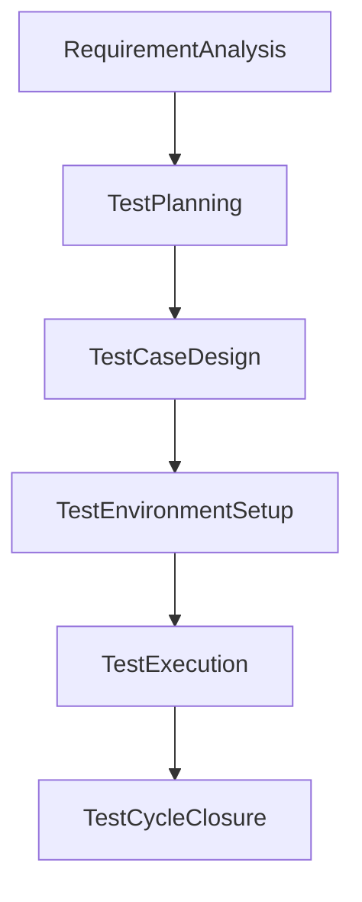

# Software Testing Life Cycle (STLC)

## Stages of STLC:

1. **Requirement Analysis:** Analyze and review the requirements for testing.
2. **Test Planning:** Create the test plan, strategy, and estimation.
3. **Test Case Design:** Design and develop test cases and test scripts.
4. **Test Environment Setup:** Set up the test environment and prepare test data.
5. **Test Execution:** Execute the test cases and report defects.
6. **Test Cycle Closure:** Evaluate test coverage, prepare test closure reports, and archive test artifacts.

## STLC Diagram:

## Test Process Document

| Phase                    | Input                                                | Activity                                                                 | Responsible Person         | Outcome                  |
|--------------------------|------------------------------------------------------|--------------------------------------------------------------------------|----------------------------|--------------------------|
| **Requirement Analysis** | List of Functional and Non-Functional Requirements   | Feasibility Study                                                        | Test Managers - 75%        | SRS Document             |
|                          | Timeline                                             | Rank the requirement                                                     | Test Leads - 25%           |                          |
|                          | Budget                                               | Types of Testing involved                                                |                            |                          |
| **Test Planning**        | SRS Document                                         | Identify the resources                                                   | Test Managers - 30%        | Test Plan Document       |
|                          | Project timeline and Budget                          | Team formation                                                           | Test Leads - 70%           |                          |
|                          |                                                      | Test Estimation                                                          |                            |                          |
|                          |                                                      | Types of Testing                                                         |                            |                          |
|                          |                                                      | Risk/Mitigation                                                          |                            |                          |
|                          |                                                      | Preparation of Testplan/Review/Sign-off                                  |                            |                          |
| **Test Case Design**     | SRS                                                  | Preparation of Test Scenarios                                            | Testers - 90%              | Test Scenarios           |
|                          | Test Plan                                            | Preparation of Test Cases                                                | Test Leads - 10%           | Test cases               |
|                          | Design Document (High level, Low level)              | Review /Sign-off                                                         |                            | RTM                      |
|                          |                                                      | Requirement traceability Matrix (RTM)                                    |                            |                          |
| **Test Environment Setup** | Test Scenarios                                     | Install the required software                                            | Testers - 90%              |                          |
|                          | Test Cases                                           | Getting the Required Access                                              | Test Leads - 10%           |                          |
|                          |                                                      | Data Setup                                                               |                            |                          |
| **Test Execution**       | Test Scenarios                                       | Execute the test cases                                                   | Testers - 90%              |                          |
|                          | Test Cases                                           | Defect Identification                                                    | Test Leads - 10%           |                          |
|                          |                                                      | Reporting the defects/Defect Triage (Working with Developers)            |                            |                          |
| **Test Closure**         |                                                      | Analyzing all the requirements are covered                               | Test Managers - 90%        | Test Closure Document    |
|                          |                                                      | Met the exit Criteria                                                    | Test Leads - 10%           | Sign-off Email           |
|                          |                                                      | Document the finding/learning                                            |                            |                          |
